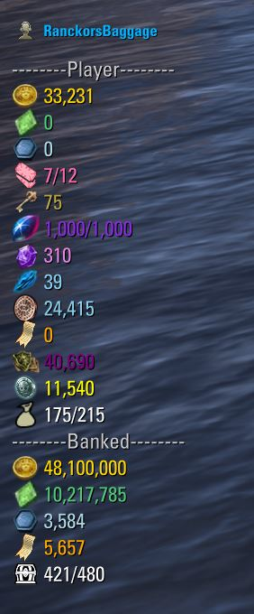
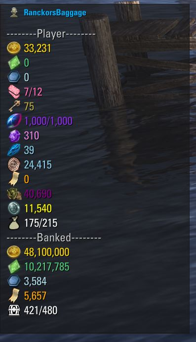
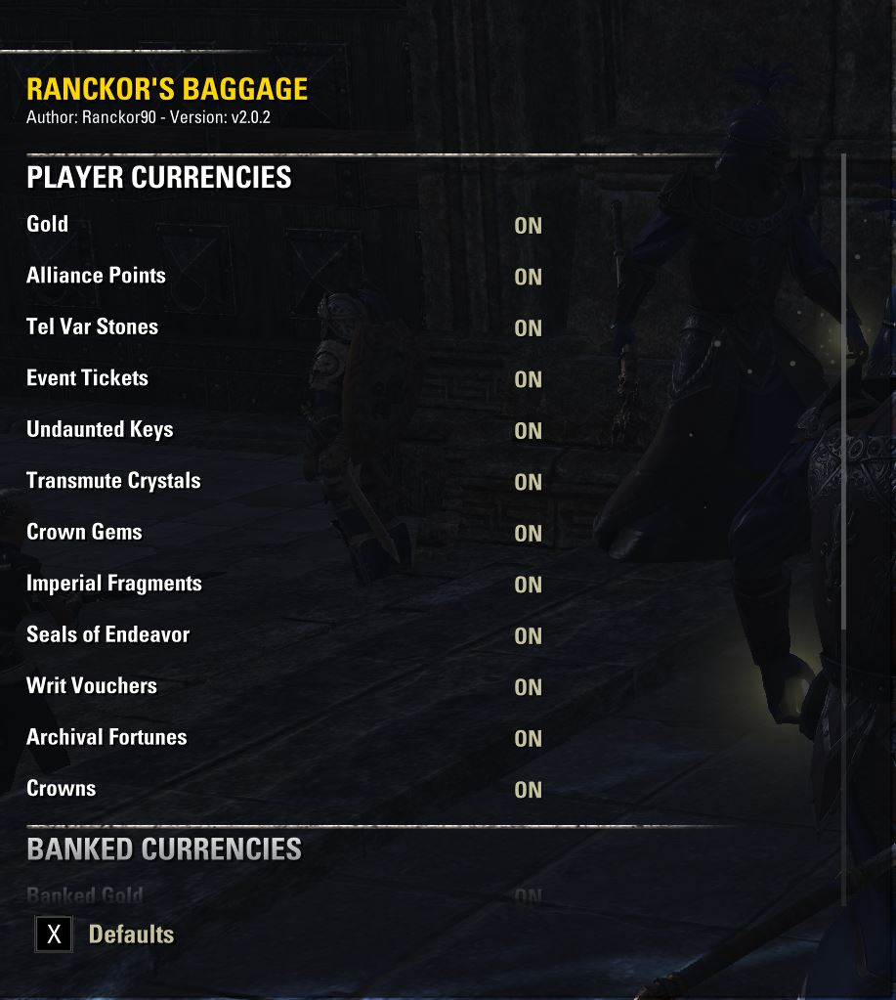
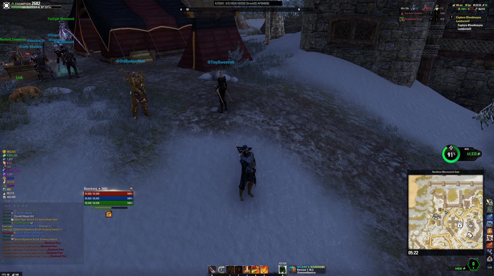

# Ranckors Baggage
#### View your currenices in a convenitent UI panel without having to navigate through your inventory menus.

#### Movable panel can be placed where it is most suitable for the player and then saved to the new position. With a Clear and Dark Theme to suit you personal need on screen, and fully customisable with the display options of the curreny to view exactly what you want it too.

#### /rb - Hide/Show UI
#### /rbsettings - Allows you to customise the Currency displayed

### You can still use the following commands, but the main functionality has moved into the Settings menu
#### /rbclear - Clear Background Option
#### /rbdark - Dark Backgorund Option

### Clear Theme

### Dark Theme

### Settings Menu

### Full Screen

##

> This Add-on is not created by, affiliated with or sponsored by ZeniMax Media Inc. or its affiliates.
> The Elder Scrolls® and related logos are registered trademarks or trademarks of ZeniMax Media Inc. in the United States and/or other countries.
> All rights reserved.
>
> You can read the full terms at https://account.elderscrollsonline.com/add-on-terms

> Report & Submit your bugs and feature requests [Here](https://illyriat.com)